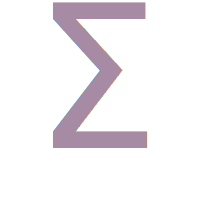
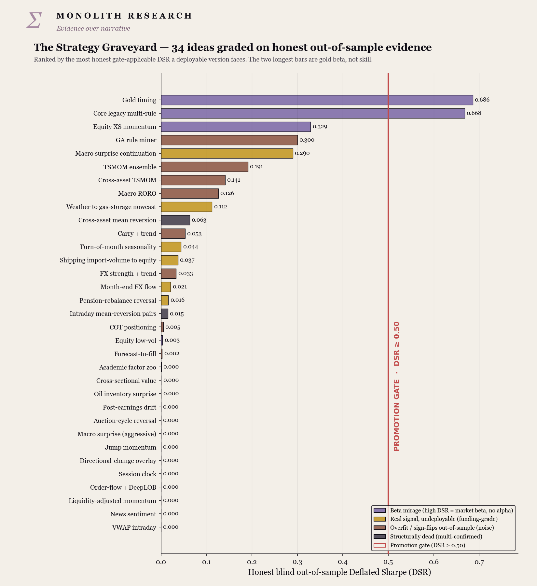

<div align="center">



# The Strategy Graveyard

**I treat my own ideas as adversaries. This is where I keep the autopsies.**

Σ · MONOLITH RESEARCH · *Evidence over narrative*


</div>

---

Most quant "research" is a hunt for the backtest that confirms a hope. I do the opposite: I try to **kill** every idea I have, on honest out-of-sample evidence, before it ever touches real capital.

This repo is the filter. Here are **34 strategies** I put through a blind out-of-sample gate. Most research doesn't survive that — *that is what the gate is for*. The ones that didn't make the cut are documented here in full, with the real numbers, no truncated curves, no favourable rounding. The strategy that **is** on live capital stays private.

This isn't a list of failures. It's the discipline that makes the thing I *do* keep worth trusting — and it's how you compete with desks fifty times your size: by being ruthless about what's real.

> **Live book:** one strategy runs on live capital and stays private — ▒▒▒▒▒▒▒▒ *(redacted)*. Everything in this repo is the research *behind* getting there, not the live book itself.

## The gate

```
DSR ≥ 0.50      PBO ≤ 0.20      trades ≥ 50      (+ positive net of 3× cost, clean placebo)
```

Run on my own validation library — PSR, Deflated Sharpe (explicit trial count + Euler–Mascheroni), PBO via CSCV, covered by known-answer tests → **[quant-validation](https://github.com/MonolithResearch/quant-validation)**.

## The whole field, ranked

<div align="center">



</div>

Each bar is the most honest, gate-applicable Deflated Sharpe a deployable version would actually face — blind held-out OOS for the rebuilds, live-realistic DSR for the alt-data work. In-sample numbers are kept for context but never used to rank.

The two longest bars — **Gold timing (0.686)** and **Core legacy (0.668)** — are the lesson, not the win: they aren't alpha, they're gold buy-and-hold beta in a 2023–26 bull. The single most valuable thing a gate does is reject your *best-looking* Sharpes, and here it does exactly that. Strip the beta and the whole field sits below DSR 0.05.

```bash
py -3.14 scripts/make_graveyard_chart.py   # regenerate from the public data
```

## How a strategy ends up here

| Category | What it means | Examples |
|----------|---------------|----------|
| **Live — private** | On real capital, internals withheld | ▒▒▒▒▒▒ *(redacted)* |
| **Beta mirage** | High DSR, but it's just market beta | Gold timing (0.686), Core legacy (0.668), Equity XS-momentum (0.329) |
| **Funding-grade** | A *real* signal, killed by cost / capacity / decay | Weather→gas (R² 0.946, DSR 0.112), Shipping import-volume (0.77 → 0.037), Turn-of-month, PEAD |
| **Overfit / sign-flips** | The in-sample number was selection; OOS reverses | OFI+DeepLOB (10.81 → −14.63 net), Session clock (2.65 → −1.98), TSMOM ensemble (1.72 → 0.108), GA miner (88,632 trials → neg) |
| **Structurally dead** | Multi-confirmed dead across rebuilds | Mean-reversion pairs (5.47 → −0.54, 7× dead), Cross-asset OU (6× dead), Cross-sectional value |

Full sanitized dataset: [`data/gate_ranking_public.csv`](data/gate_ranking_public.csv).

## Six post-mortems

| # | Strategy | The hook | Why it was retired |
|---|----------|----------|--------------------|
| [01](case_studies/01_ou_m5_stat_arb.md) | **Mean-reversion pairs** | IS Sharpe **5.47** → OOS **−0.54** | Textbook max-order-statistic mirage; the honest single config is itself negative in-sample |
| [02](case_studies/02_ofi_deeplob.md) | **Order-flow + DeepLOB** | IS **10.81** → net **−14.63** at 3× cost | Foresight is real (+1.3 bp/trade); it sits below the cost bar |
| [03](case_studies/03_gp_us_equity.md) | **Genetic-programming US equity** | OOS 0.71, FF6 α 7.2%/yr, placebo-clean | Caught by a **pre-registered blind holdout** (gross Sharpe 0.03) |
| [04](case_studies/04_cot_anti_crowding.md) | **COT anti-crowding** | Best tertile OOS **+0.50** | Locked holdout **−0.40**; it was momentum in disguise |
| [05](case_studies/05_weather_gas_nowcast.md) | **Weather → gas nowcast** | Walk-forward OOS **R² 0.946** | Genuine skill, below the cost bar (already priced, DSR 0.112) |
| [06](case_studies/06_strategy_17_ensemble.md) | **TSMOM ensemble** | Headline **1.72** → 17.6yr OOS **0.108** | A live book I retired the moment the honest number caught up with it |

## Ground rules

No live edge here — the strategy on real capital is private and never appears. No licensed data — exchange order books and point-in-time equity panels (CRSP/Compustat) stay under their terms; only methodology and summary statistics are published, and the demos run on small synthetic samples. No deployable parameters — descriptions and honest scores, never the knobs that would let someone re-trade a retired idea.

```bash
py -3.14 scripts/demo_validation.py   # runnable PSR/DSR/PBO demo on synthetic data
```

## About

**Monolith Research** is my quant startup. I'm **Bilal Malik** — Lancaster Finance (first-year: First Class), IMC Prosperity **top 15 of ~2,200**, IBT high distinction, multilingual. I run one strategy on live capital and keep it private; this repo is the research discipline behind it — the part that generalises. *(A small FTMO funded account runs on the side.)*

Part of my portfolio → **[github.com/05bilalmalik-cmd](https://github.com/05bilalmalik-cmd)**

> The gate retired both of my own live strategies before this list was even written. That isn't a bug in the process. That *is* the process.

<div align="center">

— Σ —

</div>
